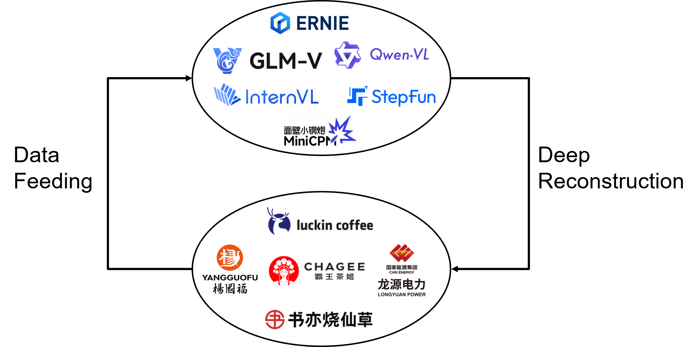
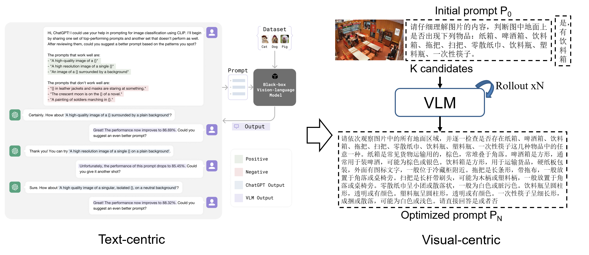



Multimodal Intelligence
======
I spent a wonderful summer (Jun-Sep, 2025) at Baidu Cloud Yijian Group and learnt a lot about multimodal intelligence. Specifically, I know how to apply general multimodal models to a specific domain. At the same time, I am thinking about how to let multimodal models themselves automatically optimize prompts to maximize their performance under zero-shot/SFT/RL settings.

**Application**

I trace latest multimodal models and apply them to many vertical domains. These general models reconstruct the application paradigm, and the vertical data is reversely fed to these models to make them specialist.

**Optimization**

In many domains, I found it so difficult to manually write a prompt for multimodal models. As a huamn, I think the prompt works well, but the model always fails. The above problem motivates me to think: Is there a way to automatically optimize these prompts from models themselves?

Traditional methods are text-centric, which means that they heavily rely on LLM(e.g., ChatGPT) to refine prompts in a pure text way(see left part). Now, we shuold be visual-centric to flow between modalities. Here is my idea: Given an image $I$, an initial prompt $p_0$ and its response $r$, we call such a triplet $(I, p_0, r)$ as a candidate. Then $K$ representative candidates are grouped for VLM optimization, where the model should rollout for $N$ times to give a final optimized prompt $p_N$. The above optimization process may involve agentic RL process, and I think it will be intriguing.

