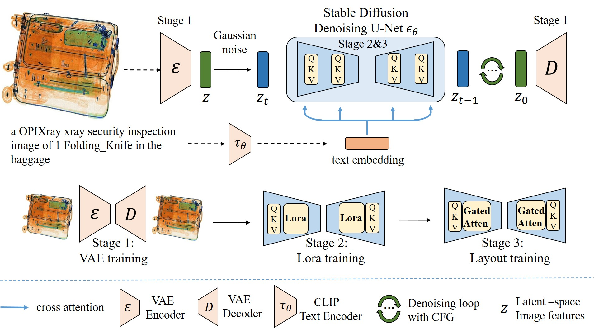



Generative Intelligence for X-ray
======
We propose a three-stage training pipeline for realistic X-ray security image generation on five common X-ray devvices, including PIDray, HiXray, OPIXray, CLCXray and PIXray.

