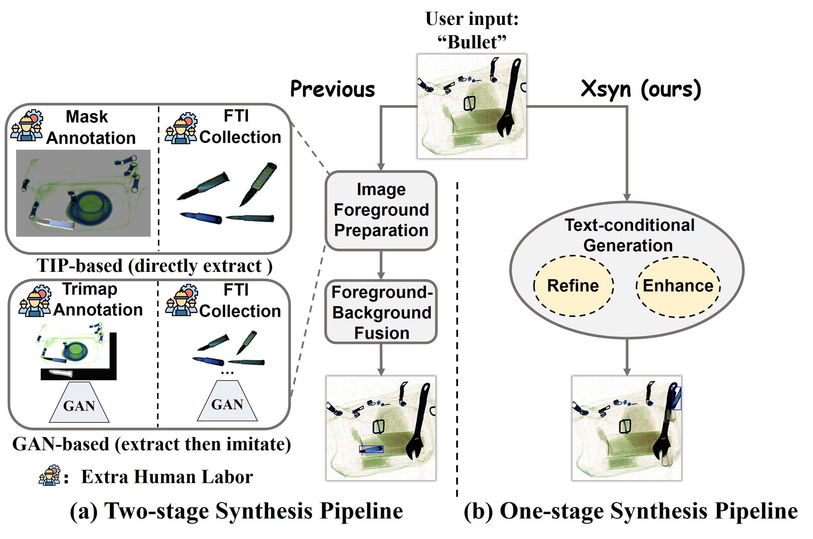

<!-- Training prohibited item detection models requires a large amount of X-ray security images, but collecting and annotating these images is time-consuming and laborious. To address data insufficiency, X-ray security image synthesis methods composite images to scale up datasets. However, previous methods primarily follow a two-stage pipeline, where they implement labor-intensive foreground extraction in the first stage and then composite images in the second stage. Such a pipeline introduces inevitable extra labor cost and is not efficient. 
In this paper, we propose a one-stage \textbf{X}-ray security image \textbf{syn}thesis pipeline (\textbf{Xsyn}) based on text-to-image generation, which incorporates two effective strategies to improve the usability of synthetic images. 
The \textbf{C}ross-\textbf{A}ttention \textbf{R}efinement (\textbf{CAR}) strategy leverages the cross-attention map from the diffusion model to refine the bounding box annotation. The \textbf{B}ackground \textbf{O}cclusion \textbf{M}odeling (\textbf{BOM}) strategy explicitly models background occlusion in the latent space to enhance imaging complexity.
To the best of our knowledge, compared with previous methods, Xsyn is the first to achieve high-quality X-ray security image synthesis without extra labor cost. 
Experiments demonstrate that our method outperforms all previous methods with 1.2\% mAP improvement, and the synthetic images generated by our method are beneficial to improve prohibited item detection performance across various X-ray security datasets and detectors. -->
<!--  -->
Coming soon...
